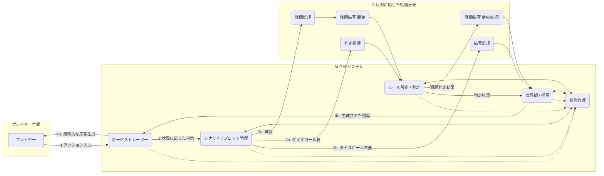

# AI_TRPG
OpenAIのエージェントフレームワークを使用したTRPG

# 現状
~~OpenAIのフレームワークであるSwarmの使用感を確認中。~~

→swarmではなく正式なエージェントフレームワークが発表されたのでそちらかlangchainに切り替える。

## エージェント

TRPGを実装するために、以下のエージェントを実装

1. **ゲームマスターエージェント（GMエージェント）**
   - プレイヤーの行動に応じてストーリーを進行し、シナリオを管理する。

2. **戦闘エージェント**
   - 戦闘の処理を担当し、ダメージ計算や結果の判定を行う。

3. **キャラクター管理エージェント**
   - キャラクターの作成、レベルアップ、ステータス更新を行う。

4. **アイテム管理エージェント**
   - アイテムの追加・削除やインベントリの管理を行う。

5. **ワールドエージェント**
   - ゲーム内の世界や環境、イベントを管理する。

6. **NPCエージェント**
   - 非プレイヤーキャラクターの行動や会話を制御する。

これらのエージェントを組み合わせて、TRPGのシステムを構築する予定。
